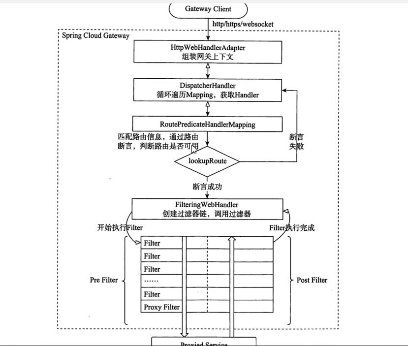
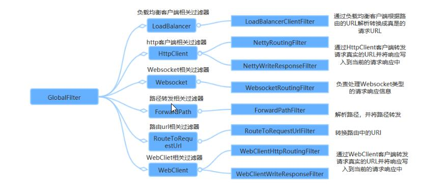
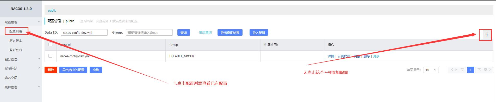
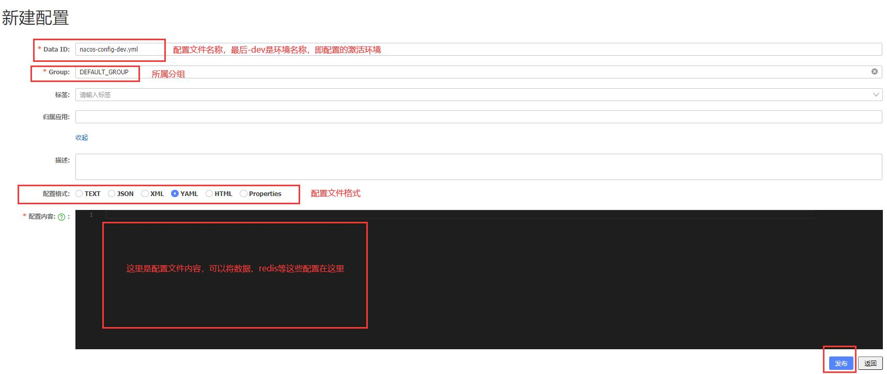
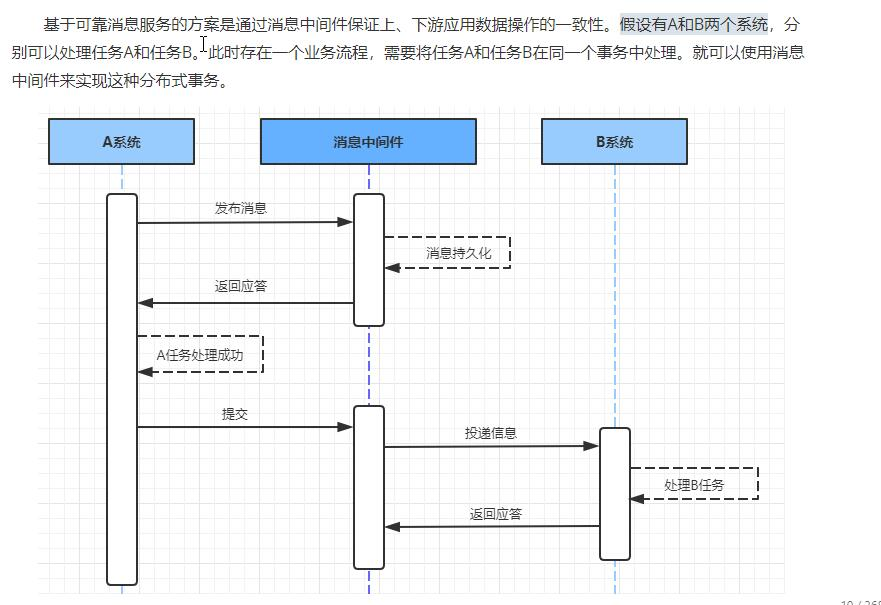
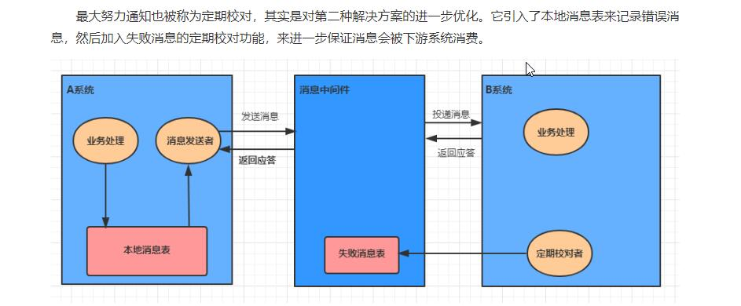
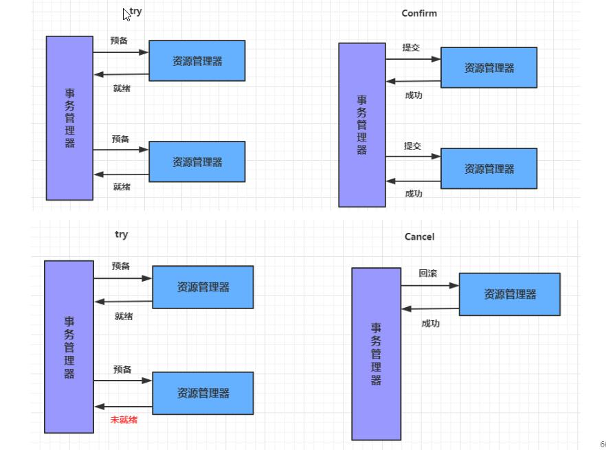
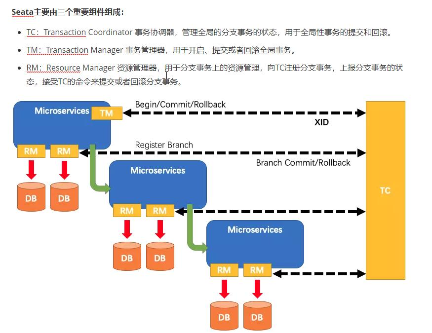

# spring cloud 阿里套件

使用阿里巴巴相关的spring cloud 套件做微服务，其根本就是替换掉我们以前用的其他的spring cloud的组件，相关依赖配置的替换而已，Spring Cloud的整体的构成还是一样的。

## 相关文档资料

* [nacos文档](https://nacos.io/zh-cn/docs/what-is-nacos.html)
* [nacos Github](https://github.com/alibaba/nacos/releases)
* [示例项目建表SQL](建表SQL.sql)
* [Sentinel官方文档](https://sentinelguard.io/zh-cn/docs/dashboard.html)
* [Sentinel的Github](https://github.com/alibaba/Sentinel)

## 目录

```text
    |---注册中心改为nacos（nacos也可以作为配置中心）；用于替换eureka
    |---熔断限流组件sentinel；用于替换掉Hystrix
    |---网关`spring-cloud-gateway`，使用nacos做注册中心替换eureka
    |---`nacos配置中心`，替换掉spring-cloud的config组件，其实原理也是在spring-cloud-config的基础上进行扩展的
    |---分布式事务
    |---Dubbo替换掉feign；使用Dubbo来做RPC服务调用
```

## 一、注册中心nacos

部署一个服务端；注意分 集群和单机模式，集群模式下必须配置正确，否则将影响服务注册。可以使用docker部署

### 使用安装包安装

在Windows上直接解压后，进入bin目录中双击`startup.cmd`运行文件即可

Linux/Unix/Mac
> 启动命令(standalone代表着单机模式运行，非集群模式):

    sh startup.sh -m standalone

如果您使用的是ubuntu系统，或者运行脚本报错提示[[符号找不到，可尝试如下运行：

    bash startup.sh -m standalone

访问[http://127.0.0.1:8848/nacos](http://127.0.0.1:8848/nacos)即可，账号和密码默认为`nacos`

## 二、注册服务到nacos

1. 在项目中添加如下依赖：

```xml
<dependency>
  <groupId>com.alibaba.cloud</groupId>
  <artifactId>spring-cloud-starter-alibaba-nacos-discovery</artifactId>
</dependency>
```

> 这个依赖用于替换eureka的客户端依赖包 `spring-cloud-starter-netflix-eureka-client`

2. 在启动类上添加 `@EnableDiscoveryClient`注解；其实使用eureka做注册中心时，也建议使用此注解，方便后期更换注册中心。

3. 在application配置文件中添加nacos的配置

```yaml
spring:
   cloud:
     nacos:
       discovery:
         # nacos的地址
         server-addr: 127.0.0.1:8848
```

成功后即可在nacos控制台中查看；pom依赖示例如下： 父工程pom.xml

```xml
<dependencyManagement>
    <dependencies>
        <!-- spring boot依赖约束 -->
        <dependency>
            <groupId>org.springframework.boot</groupId>
            <artifactId>spring-boot-dependencies</artifactId>
            <version>2.3.7.RELEASE</version>
            <type>pom</type>
            <scope>import</scope>
        </dependency>
        
        <!-- spring cloud alibaba依赖约束 -->
        <dependency>
            <groupId>com.alibaba.cloud</groupId>
            <artifactId>spring-cloud-alibaba-dependencies</artifactId>
            <version>2.2.2.RELEASE</version>
            <type>pom</type>
            <scope>import</scope>
        </dependency>
        
        <!-- spring cloud 依赖约束 -->
        <dependency>
            <groupId>org.springframework.cloud</groupId>
            <artifactId>spring-cloud-dependencies</artifactId>
            <version>Hoxton.SR9</version>
            <type>pom</type>
            <scope>import</scope>
        </dependency>
        
        <!-- 数据库依赖 -->
        <dependency>
            <groupId>com.baomidou</groupId>
            <artifactId>mybatis-plus-boot-starter</artifactId>
            <version>3.3.2</version>
        </dependency>
        <dependency>
            <groupId>mysql</groupId>
            <artifactId>mysql-connector-java</artifactId>
            <version>8.0.20</version>
        </dependency>
        
        <!-- 业务依赖包 -->
        <dependency>
            <groupId>top.vchar</groupId>
            <artifactId>common-dto</artifactId>
            <version>1.0-SNAPSHOT</version>
        </dependency>
    </dependencies>
</dependencyManagement>

<build>
    <plugins>
        <plugin>
            <groupId>org.apache.maven.plugins</groupId>
            <artifactId>maven-compiler-plugin</artifactId>
            <version>3.8.1</version>
            <configuration>
                <source>1.8</source>
                <target>1.8</target>
                <encoding>UTF-8</encoding>
            </configuration>
        </plugin>
        <plugin>
            <groupId>org.springframework.boot</groupId>
            <artifactId>spring-boot-maven-plugin</artifactId>
            <version>2.3.7.RELEASE</version>
            <executions>
                <execution>
                    <id>repackage</id>
                    <goals>
                        <goal>repackage</goal>
                    </goals>
                </execution>
            </executions>
        </plugin>
    </plugins>
</build>
```

子工程依赖：

```xml
<parent>
  <artifactId>alibaba-micro-services</artifactId>
  <groupId>top.vchar</groupId>
  <version>1.0-SNAPSHOT</version>
</parent>
<modelVersion>4.0.0</modelVersion>

<artifactId>order-center</artifactId>
<version>0.0.1-SNAPSHOT</version>
<packaging>jar</packaging>
<name>order-center</name>
<description>订单中心</description>

<dependencies>
  <dependency>
      <groupId>org.springframework.boot</groupId>
      <artifactId>spring-boot-starter-web</artifactId>
  </dependency>
  <dependency>
      <groupId>org.springframework.boot</groupId>
      <artifactId>spring-boot-starter-test</artifactId>
      <scope>test</scope>
      <exclusions>
          <exclusion>
              <groupId>org.junit.vintage</groupId>
              <artifactId>junit-vintage-engine</artifactId>
          </exclusion>
      </exclusions>
  </dependency>
  
  <!-- nacos 服务注册客户端依赖 -->
  <dependency>
      <groupId>com.alibaba.cloud</groupId>
      <artifactId>spring-cloud-starter-alibaba-nacos-discovery</artifactId>
  </dependency>

  <!-- lombok 注解，自动生成get/set方法，开发工具上需要安装lombok插件 -->
  <dependency>
      <groupId>org.projectlombok</groupId>
      <artifactId>lombok</artifactId>
  </dependency>
  
  <!-- 数据库依赖 -->
  <dependency>
      <groupId>mysql</groupId>
      <artifactId>mysql-connector-java</artifactId>
  </dependency>
  <dependency>
      <groupId>com.baomidou</groupId>
      <artifactId>mybatis-plus-boot-starter</artifactId>
  </dependency>

  <!-- 业务依赖 -->
  <dependency>
      <groupId>top.vchar</groupId>
      <artifactId>common-dto</artifactId>
  </dependency>
</dependencies>
```

## 三、服务调用

### 3.1 使用RestTemplate调用

#### 注入RestTemplate的bean

```java
 /**
  * 加上 @LoadBalanced使其使用ribbon的负载均衡
  */
 @Bean
 @LoadBalanced
 public RestTemplate restTemplate(){
     return new RestTemplate();
 }
```

#### 方式一：直接写服务地址调用服务

这种方式就不需要注册中心了, 直接像普通的接口请求即可

```java
GoodsDetailDTO goodsDetailDTO = restTemplate.getForObject("http://127.0.0.1:8093/goods/detail/"+createOrderDTO.getGoodsNo(), GoodsDetailDTO.class);
```

#### 方式二：通过`org.springframework.cloud.client.discovery.DiscoveryClient`来获取服务信息

`DiscoveryClient` 对象中保存有注册到注册中心的服务信息，包括服务的名称、IP、端口号等信息。通过服务名称可以获取到该服务的信息。

```java
// discoveryClient.getInstances 返回的是一个list列表，因此可以基于此可以自己去实现负载均衡；  
ServiceInstance goodsServer = discoveryClient.getInstances("goods-server").get(0);
GoodsDetailDTO goodsDetailDTO = restTemplate.getForObject("http://"+goodsServer.getHost()+":"+goodsServer.getPort()+"/goods/detail/"+createOrderDTO.getGoodsNo(), GoodsDetailDTO.class);
```

#### 方式三：在restTemplate bean注入的地方添加 @LoadBalanced注解；会自动使用ribbon来实现负载均衡

```java
// 在restTemplate bean注入的地方添加 @LoadBalanced注解；会自动使用ribbon来实现负载均衡
GoodsDetailDTO goodsDetailDTO = restTemplate.getForObject("http://goods-server/goods/detail/"+createOrderDTO.getGoodsNo(), GoodsDetailDTO.class);
```

> 默认的负载均衡规则是轮询的方式；可以在配置文件中指定服务使用那种方式；示例如下：

```yml
#服务名称
goods-server:
   ribbon:
     # 使用随机的方式
     NFLoadBalancerRuleClassName: com.netflix.loadbalancer.RandomRule
```

### 3.2 使用feign调用服务

1.添加feign依赖
 
```xml
<dependency>
   <groupId>org.springframework.cloud</groupId>
   <artifactId>spring-cloud-starter-openfeign</artifactId>
</dependency>
```      

2.在启动类上添加`@EnableFeignClients`注解，启动feign功能

3.编写feign客户端

```java
import org.springframework.cloud.openfeign.FeignClient;
import org.springframework.web.bind.annotation.GetMapping;
import org.springframework.web.bind.annotation.PathVariable;
import top.vchar.goods.dto.GoodsDetailDTO;

/**
* <p> 商品服务 feign客户端 </p>
*
* value 就是服务的名称
* @author vchar fred
* @version 1.0
* @create_date 2020/6/15
*/
@FeignClient(value = "goods-server")
public interface GoodsFeignClient {

  /**
   * 通过商品编号获取商品
   * @param goodsNo 商品编号
   * @return 返回结果
   */
  @GetMapping("/goods/detail/{goodsNo}")
  GoodsDetailDTO findGoodsDetailByGoodsNo(@PathVariable("goodsNo") String goodsNo);
}
```
4.业务代码中调用    

```text
GoodsDetailDTO goodsDetailDTO = goodsFeignClient.findGoodsDetailByGoodsNo(createOrderDTO.getGoodsNo());
```    

### 3.3 使用Dubbo调用服务

1.添加dubbo的依赖

```xml
<dependency>
    <groupId>com.alibaba.cloud</groupId>
    <artifactId>spring-cloud-starter-dubbo</artifactId>
</dependency>
```

2.修改配置文件(服务消费者和服务提供者配置都一样)
```yaml
dubbo:
  protocol:
    name: dubbo
    # 这个dubbo的协议端口在一台服务器上的时候，每个项目的必须配置成不一样的（否则将启动失败），或者配置为-1，使用随机端口
    port: 20880
  registry:
    # 由于使用的是spring-cloud，因此这里使用spring-cloud的
    address: spring-cloud://192.168.56.1.102
  scan:
    # 配置需要扫描的注解包
    base-packages: top.vchar
```

3.使用方式：我们无需像feign那样再去编写一个类，对应需要提供对外服务的接口直接在接口的实现上将`@Service` 注解改为`org.apache.dubbo.config.annotation.DubboService` 注解即可。
服务调用方直接在要使用的服务接口上加上 `@DubboReference` 注解即可。

接口（因为服务调用方也需要使用，因此我们需要将接口单独提取到一个jar包）
```java
public interface GoodsService {
    /**
     * 通过ID查询商品详情
     * @param id 商品ID
     * @return 返回结果
     */
    GoodsDetailDTO findGoodsById(Long id);
}
```

服务提供者（就是普通的接口方法实现）
```java
@DubboService
public class GoodsServiceImpl implements GoodsService {

    @Override
    public GoodsDetailDTO findGoodsById(Long id) {
        System.out.println("查询数据");
        GoodsDetailDTO goods = new GoodsDetailDTO();
        goods.setGoodsNo(String.valueOf(id));
        goods.setGoodsName("手机");
        goods.setInventory(2);
        goods.setPrice(new BigDecimal("3000"));
        return goods;
    }
}
```

服务调用
```java
// 要调用的远程服务
@DubboReference
private GoodsService goodsService;

@Override
public String booking(Long id, int num) {
    GoodsDetailDTO goods = this.goodsService.findGoodsById(id);
    System.out.println(JSONObject.toJSONString(goods));

    return goods.getGoodsName();
}
```

## 四、熔断限流组件 sentinel 

* [官方文档地址](https://sentinelguard.io/zh-cn/docs/dashboard.html)
* [Sentinel的github](https://github.com/alibaba/Sentinel)

这个在阿里云有企业级的商用版本 [应用高可用服务 AHAS](https://help.aliyun.com/document_detail/144439.html)；现在有免费的入门级可以先体验下，之后再决定是否使用付费的专业版或者是自己搭建。

### sentinel功能概述

* 流量控制：将随机的请求调整为合适的形状。即限制请求数量
* 熔断降级：当检测到调用链路中某个资源出现不稳定的表现，如请求响应时间长或者异常比例升高的时候，则对此资源的调用进行限制，让请求快速失败，避免影响到其它的资源而导致级联故障。
采用的手段：1.并发线程数的限制；2.通过响应时间进行降级

> 和Hystrix的区别：两者的原则是一致的，都是当一个资源出现问题时，让其快速失败，不波及到其它服务。
>   Hystrix采用的是线程池隔离的方式，优点是做到了资源之间的隔离，缺点是增加了线程切换的成本
>   Sentinel采用的是通过并发线程的数量和响应时间来对资源的限制。 
* 系统负载保护：Sentinel提供系统维度的自适应保护能力。即在系统负载较高时，自动将流量转发到其它集群中的机器上去，
使系统的入口流量和系统的负载达到一个平衡，保护系统能力范围内处理最多的请求。

### 安装控制台界面工具

在Sentinel的Github上下载安装包[https://github.com/alibaba/Sentinel/releases](https://github.com/alibaba/Sentinel/releases)；就是一个jar包直接使用命令启动即可。

```shell
java -Dserver.port=9080 -Dcsp.sentinel.dashboard.server=localhost:9080 -Dproject.name=sentinel-dashboard -jar sentinel-dashboard.jar
```

> -Dserver.port 是设置访问的端口号； 
> sentinel-dashboard.jar就是刚刚下载的jar包名称；
> 为方便使用可以创建一个bat启动文件，在里面输入上面的命令行，后面启动直接点击这个bat文件即可。

从 Sentinel 1.6.0 起，Sentinel 控制台引入基本的登录功能，默认用户名和密码都是 sentinel

### 服务中使用

添加如下依赖

```xml
<dependency>
  <groupId>com.alibaba.cloud</groupId>
  <artifactId>spring-cloud-starter-alibaba-sentinel</artifactId>
</dependency>
```

添加配置

```yaml
spring:
   cloud:
     # 配置 sentinel
     sentinel:
       transport:
         # 指定和sentinel控制台服务交换的端口，随意指定一个没有使用的即可
         port: 8719
         # sentinel控制台的访问地址
         dashboard: 127.0.0.1:9080
```

### Sentinel规则

Sentinel默认定义如下规则：

#### 流控规则

通过QPS或并发线程数来做限制，里面的针对来源可以对某个微服务做限制，默认是都限制。

* 流控模式：
 - 直接：接口达到限流条件，开启限流；
 - 关联：当关联的资源达到限流条件时，开启限流（适合做应用让步）
 - 链路：当从某个接口过来的资源达到限流条件时，开启限流（限制更细致）

关于配置规则：可以直接使用url地址来配置，也可以通过自定义名称来配置（需要在方法上添加`@SentinelResource("order")`注解才能达到效果，可以重复）

> 链路限流不生效的问题：由于sentinel基于filter开发的拦截使用的链路收敛的模式，因此需要设置关闭链路收敛使链路收敛能够生效，

```yaml
spring:
   cloud:
     sentinel:
       filter:
         # 关闭链路收敛使链路收敛能够生效
         enabled: false
```

#### 降级规则

当满足设置的条件，对服务进行降级。

* 根据平均响应时间：当资源的平均响应时间超过阀值（以ms为单位）之后，资源进入准降级状态。
如果接下来1秒持续进入的n个请求的RT都持续超过这个阀值，则在接下来的时间窗口（单位s）之内就会使这个方法进行服务降级。

> 注意Sentinel默认的最大时间为4900ms，超过这个时间将被默认设置为4900ms；可以通过启动配置 -Dcsp.sentinel.statistic.max.rt=xxx来修改。

* 异常降级：通过设置异常数或者异常比例来进行服务降级。

#### 热点规则

必须使用`@SentinelResource("order")`注解来做标记，将限流做到参数级别上去，并且可以配置排除参数值等于某个值时不做限流。

#### 授权规则

通过配置黑白名单来设置是否允许通过。

自定义来源获取规则：

```java
import com.alibaba.csp.sentinel.adapter.servlet.callback.RequestOriginParser;
import org.apache.commons.lang3.StringUtils;
import org.springframework.stereotype.Component;

import javax.servlet.http.HttpServletRequest;

/**
* <p> sentinel自定义授权来源获取规则 </p>
*
* @author vchar fred
* @version 1.0
* @create_date 2020/6/15
*/
@Component
public class RequestOriginParserDefinition implements RequestOriginParser {

  /**
   * 定义区分来源的规则：本质上是通过获取request域中获取来源标识，然后交给流控应用来进行匹配处理
   *
   * @param request request域
   * @return 返回区分来源的值
   */
  @Override
  public String parseOrigin(HttpServletRequest request) {
      String client = request.getHeader("client");
      if(StringUtils.isNotBlank(client)){
          return "NONE";
      }
      return client;
  }
}
```

#### 系统规则

系统保护规则是从应用级别的入口流量进行控制，从单台机器的总体Load、RT、入口QPS、CPU使用率和线程数五个维度来监控整个应用数据，让系统跑到最大吞吐量的同时保证系统稳定性。

* Load（仅对 Linux/Unix-like 机器生效）：当系统 load1 超过阈值，且系统当前的并发线程数超过系统容量时才会触发系统保护。系统容量由系统的 maxQps * minRt 计算得出。设定参考值一般是 CPU cores * 2.5。
* RT：当单台机器上所有入口流量的平均 RT 达到阈值即触发系统保护，单位是毫秒。
* 线程数：当单台机器上所有入口流量的并发线程数达到阈值即触发系统保护。
* 入口 QPS：当单台机器上所有入口流量的 QPS 达到阈值即触发系统保护。
* CPU使用率：当单台机器上所有入口流量的 CPU使用率达到阈值即触发系统保护。

### 自定义Sentinel的异常返回

通过实现`com.alibaba.csp.sentinel.adapter.servlet.callback.UrlBlockHandler`接口来自定义异常返回。

```java
@Component
public class SentinelExceptionHandler implements UrlBlockHandler {

  /**
   * 异常处理
   * 
   * @param request 请求
   * @param response 响应
   * @param e BlockException异常接口，包含Sentinel的五个异常
   *              FlowException  限流异常
   *              DegradeException  降级异常
   *              ParamFlowException  参数限流异常
   *              AuthorityException  授权异常
   *              SystemBlockException  系统负载异常
   *              
   * @throws IOException IO异常
   */
  @Override
  public void blocked(HttpServletRequest request, HttpServletResponse response, BlockException e) throws IOException {
      JSONObject responseData = new JSONObject();
      if (e instanceof FlowException) {
          responseData.put("message", "限流异常");
          responseData.put("code", "C5001");
      } else if (e instanceof DegradeException) {
          responseData.put("message", "降级异常");
          responseData.put("code", "C5002");
      } else if(e instanceof ParamFlowException){
          responseData.put("message", "参数限流异常");
          responseData.put("code", "C5003");
      } else if(e instanceof AuthorityException){
          responseData.put("message", "授权异常");
          responseData.put("code", "C5004");
      } else if(e instanceof SystemBlockException){
          responseData.put("message", "系统负载异常");
          responseData.put("code", "C5005");
      }
      response.setContentType("application/json;charset=utf-8");
      response.getWriter().write(responseData.toJSONString());
  }
}
```

### 注解@SentinelResource的说明

使用`@SentinelResource`可以定义资源点，在定义了资源点之后，我们可以通过Dashboard来设置限流和降级策略来对资源点进行保护。同时还能通过@SentinelResource来指定出现异常时的处理策略。

```java
/**
* 查询订单信息 @SentinelResource注解实现熔断
*
* <p>
*     blockHandler: 当内部发生BlockException异常时触发
*     fallback：     当内部发生Throwable异常时触发
* </p>
*
* @param orderNo 订单编号
* @return 返回订单信息
*/
@SentinelResource(value = "order-detail", blockHandler = "blockHandler", fallbackClass = SentinelResourceDemoFallback.class)
@Override
public OrderDetailDTO sentinelResourceDemo(String orderNo) {
  OrderDetailDTO orderDetail = findOrderByOrderNo(orderNo);
  Assert.notNull(orderDetail, "无此订单信息");
  return orderDetail;
}

/**
* 发生BlockException异常时触发，注意返回值和参数必须和原理的相同，这个和feign的差不多
*/
public OrderDetailDTO blockHandler(String orderNo, BlockException e) {
  log.error("触发降级限流异常", e);
  return null;
}

/**
* 发生Throwable异常时触发，注意返回值和参数必须和原理的相同，这个和feign的差不多；这个异常处理类通常会单独写到一个类文件中，避免业务类代码臃肿。
*/
@Slf4j
public static class SentinelResourceDemoFallback{
  // 这个方法必须使用 static 修饰方法
  public static OrderDetailDTO fallback(String orderNo, Throwable throwable){
      log.error("无此订单信息", throwable);
      return null;
  }
}
``` 
> 定义限流和降级后的处理方法可以直接定义在方法中，也可以重新定义一个类来处理            

### Sentinel规则持久化     

Sentinel 控制台通过 API 将规则推送至客户端并更新到内存中，接着注册的写数据源会将新的规则保存到本地的文件中。

编写一个实现InitFunc接口的类，在里面定义持久化的方式，这里使用文件

```java
public class FilePersistence implements InitFunc {

  @Value("spring.application.name")
  private String applicationName;

  @Override
  public void init() throws Exception {
      String ruleDir = System.getProperty("user.home") + "/sentinel-rules/" + applicationName;
      String flowRulePath = ruleDir + "/flow-rule.json";
      String degradeRulePath = ruleDir + "/degrade-rule.json";
      String systemRulePath = ruleDir + "/system-rule.json";
      String authorityRulePath = ruleDir + "/authority-rule.json";
      String paramFlowRulePath = ruleDir + "/param-flow-rule.json";

      this.mkdirIfNotExits(ruleDir);
      this.createFileIfNotExits(flowRulePath);
      this.createFileIfNotExits(degradeRulePath);
      this.createFileIfNotExits(systemRulePath);
      this.createFileIfNotExits(authorityRulePath);
      this.createFileIfNotExits(paramFlowRulePath);

      // 流控规则
      ReadableDataSource<String, List<FlowRule>> flowRuleRDS = new FileRefreshableDataSource<>(
              flowRulePath,
              flowRuleListParser
      );
      FlowRuleManager.register2Property(flowRuleRDS.getProperty());
      WritableDataSource<List<FlowRule>> flowRuleWDS = new FileWritableDataSource<>(
              flowRulePath,
              this::encodeJson
      );
      WritableDataSourceRegistry.registerFlowDataSource(flowRuleWDS);

      // 降级规则
      ReadableDataSource<String, List<DegradeRule>> degradeRuleRDS = new FileRefreshableDataSource<>(
              degradeRulePath,
              degradeRuleListParser
      );
      DegradeRuleManager.register2Property(degradeRuleRDS.getProperty());
      WritableDataSource<List<DegradeRule>> degradeRuleWDS = new FileWritableDataSource<>(
              degradeRulePath,
              this::encodeJson
      );
      WritableDataSourceRegistry.registerDegradeDataSource(degradeRuleWDS);

      // 系统规则
      ReadableDataSource<String, List<SystemRule>> systemRuleRDS = new FileRefreshableDataSource<>(
              systemRulePath,
              systemRuleListParser
      );
      SystemRuleManager.register2Property(systemRuleRDS.getProperty());
      WritableDataSource<List<SystemRule>> systemRuleWDS = new FileWritableDataSource<>(
              systemRulePath,
              this::encodeJson
      );
      WritableDataSourceRegistry.registerSystemDataSource(systemRuleWDS);

      // 授权规则
      ReadableDataSource<String, List<AuthorityRule>> authorityRuleRDS = new FileRefreshableDataSource<>(
              authorityRulePath,
              authorityRuleListParser
      );
      AuthorityRuleManager.register2Property(authorityRuleRDS.getProperty());
      WritableDataSource<List<AuthorityRule>> authorityRuleWDS = new FileWritableDataSource<>(
              authorityRulePath,
              this::encodeJson
      );
      WritableDataSourceRegistry.registerAuthorityDataSource(authorityRuleWDS);

      // 热点参数规则
      ReadableDataSource<String, List<ParamFlowRule>> paramFlowRuleRDS = new FileRefreshableDataSource<>(
              paramFlowRulePath,
              paramFlowRuleListParser
      );
      ParamFlowRuleManager.register2Property(paramFlowRuleRDS.getProperty());
      WritableDataSource<List<ParamFlowRule>> paramFlowRuleWDS = new FileWritableDataSource<>(
              paramFlowRulePath,
              this::encodeJson
      );
      ModifyParamFlowRulesCommandHandler.setWritableDataSource(paramFlowRuleWDS);
  }

  private Converter<String, List<FlowRule>> flowRuleListParser = source -> JSON.parseObject(
          source,
          new TypeReference<List<FlowRule>>() {
          }
  );
  private Converter<String, List<DegradeRule>> degradeRuleListParser = source -> JSON.parseObject(
          source,
          new TypeReference<List<DegradeRule>>() {
          }
  );
  private Converter<String, List<SystemRule>> systemRuleListParser = source -> JSON.parseObject(
          source,
          new TypeReference<List<SystemRule>>() {
          }
  );

  private Converter<String, List<AuthorityRule>> authorityRuleListParser = source -> JSON.parseObject(
          source,
          new TypeReference<List<AuthorityRule>>() {
          }
  );

  private Converter<String, List<ParamFlowRule>> paramFlowRuleListParser = source -> JSON.parseObject(
          source,
          new TypeReference<List<ParamFlowRule>>() {
          }
  );

  private void mkdirIfNotExits(String filePath) throws IOException {
      File file = new File(filePath);
      if (!file.exists()) {
          file.mkdirs();
      }
  }

  private void createFileIfNotExits(String filePath) throws IOException {
      File file = new File(filePath);
      if (!file.exists()) {
          file.createNewFile();
      }
  }

  private <T> String encodeJson(T t) {
      return JSON.toJSONString(t);
  }
}
```

在resources下创建配置目录`META-INF/services`,然后添加文件 `com.alibaba.csp.sentinel.init.InitFunc`；在文件中添加上面写的配置类的全路径`top.vchar.order.config.FilePersistence`

### Feign整合Sentinel 

这里相关配置其实和使用Hystrix基本上差不多，如果原来使用的是Hystrix组件做服务熔断，只需要修改配置文件和替换相关的依赖即可，原来的容错代码无需修改即可切换到sentinel

1. 首先添加Sentinel的依赖

```xml
<dependency>
   <groupId>com.alibaba.cloud</groupId>
   <artifactId>spring-cloud-starter-alibaba-sentinel</artifactId>
</dependency>
```

2. 在配置文件中开启Feign对Sentinel的支持

```yaml
feign:
 sentinel:
   enabled: true
```

3. 创建容错类

> 容错类要求必须实现被容错的接口,并为每个方法实现容错方案

```java
/**
  * <p> feign 的Sentinel容错类 </p>
  *
  * 容错类要求必须实现被容错的接口,并为每个方法实现容错方案
  *
  * @author vchar fred
  * @version 1.0
  * @create_date 2020/6/15
  */
 @Slf4j
 @Component
 public class GoodsFeignClientFallBack implements GoodsFeignClient {
 
     @Override
     public GoodsDetailDTO findGoodsDetailByGoodsNo(String goodsNo) {
         log.error("服务异常");
         // TODO
         return null;
     }
 }
```

4. 为被容器的接口指定容错类 

```java
@FeignClient(value = "goods-server", fallback = GoodsFeignClientFallBack.class)
public interface GoodsFeignClient {

  /**
   * 通过商品编号获取商品
   *
   * @param goodsNo 商品编号
   * @return 返回结果
   */
  @GetMapping("/goods/detail/{goodsNo}")
  GoodsDetailDTO findGoodsDetailByGoodsNo(@PathVariable("goodsNo") String goodsNo);

}
```

上面这种方式无法将异常记录下来，建议使用下面这种方式

```java
@Component
public class GoodsFeignClientFallBackFactory implements FallbackFactory<GoodsFeignClient> {
  
  @Override
  public GoodsFeignClient create(Throwable throwable) {
      throwable.printStackTrace();
      return new GoodsFeignClient() {
          @Override
          public GoodsDetailDTO findGoodsDetailByGoodsNo(String goodsNo) {
              // TODO
              return null;
          }
      };
  }
}
```

上面的容错配置改为使用`fallbackFactory`;

> 注意2种方式只能使用1种

### 使用配置中心Nacos来获取sentinel的规则，然后主动推送到客户端

* [动态规则扩展](https://sentinelguard.io/zh-cn/docs/dynamic-rule-configuration.html)
* [Nacos实现的demo](https://github.com/alibaba/Sentinel/blob/master/sentinel-extension/sentinel-datasource-nacos/src/main/java/com/alibaba/csp/sentinel/datasource/nacos/NacosDataSource.java)

添加如下依赖

```xml
<dependency>
    <groupId>com.alibaba.csp</groupId>
    <artifactId>sentinel-datasource-nacos</artifactId>
</dependency>
```

添加如下配置（具体可以参考`SentinelProperties` 配置类）：

```yaml
spring:
  cloud:
    sentinel:
      datasource:
        flow:
          # 配置nacos的
          nacos:
            rule-type: FLOW
            server-addr: 127.0.0.1:8848
            namespace: public
            groupId: "DEFAULT_GROUP"
            dataId: dubbo-customer-demo-sentinel.rule
            username: nacos
            password: 123456
```
然后在nacos中创建一个配置文件 dubbo-customer-demo-sentinel.rule，类型为text; 具体配置参数见官网说明；下面是一个示例：

```text
[
    {
        "resource": "SentinelDemoService#sentinelDemo2",
        "count": 0,
        "grade": 1,
        "limitApp":"default",
        "strategy":0,
        "controlBehavior":0,
        "clusterMode":false
    }
]
```

实际使用不建议这样做，还是建议使用控制台的方式；因为使用官方提供的集成方式时，nacos的时候会疯狂的拉取数据，同时只支持一个规则的配置；因此要么自己去基于nacos实现，要么使用控制台的方式；
且配置项很多，因此还是建议使用控制台的方式来实现，或者是对接其rest api接口，在实际操作中还是建议使用界面化的操作。

## 五、网关`spring-cloud-gateway`

### 5.1 添加依赖：

```xml
<dependency>
  <groupId>org.springframework.cloud</groupId>
  <artifactId>spring-cloud-starter-gateway</artifactId>
</dependency>
```

> 不要引入 spring-boot-starter-web的包，因为spring-cloud-gateway使用的是响应式编程webflux

### 5.2 网关配置

#### 简单的配置

```yaml
spring:
   cloud:
       gateway:
         # 配置路由
         routes:
           # 当前路由转发标识，需要唯一；默认是UUID
           - id: order_server
           # 请求最终要转发的地址
             uri: http://127.0.0.1:8095
           # 路由优先级，数字越小优先级越大
             order: 1
           # 断言（返回的是boolean, 即路由转发满足的条件；可以写多个条件）
             predicates:
               - Path=/order/**  # 以/order开头的地址
           # 过滤器
             filters:
               - StripPrefix=1  # 在请求转发前去掉一层路径
```

> 最终转发地址说明：当请求路径符合predicates中配置的规则时，最终转发的地址为 `uri+predicates.Path`, 即会将实际访问地址的前面的`http://127.0.0.1:7000`替换为配置的uri。
> 因此我们可以通过filters来对转发路径进行处理。

示例：当通过网关访问`http://127.0.0.1:7000/order/detail/EC1591941371689`时，最终访问的是`http://127.0.0.1:8095/order/detail/EC1591941371689`

#### 基于注册中心Nacos来配置

引入依赖包：

```xml
<dependency>
  <groupId>com.alibaba.cloud</groupId>
  <artifactId>spring-cloud-starter-alibaba-nacos-discovery</artifactId>
</dependency>
```

在启动类上添加`@EnableDiscoveryClient`注解；修改配置

```yaml
spring:
   cloud:
     nacos:
       discovery:
         server-addr: 127.0.0.1:8848
     gateway:
       discovery:
         locator:
           # 开启网关对注册中心的支持
           enabled: true
       routes:
         - id: order_server
         # lb是设置从注册中心按服务名称获取服务信息，并遵循负载均衡策略
           uri: lb://order-server
           predicates:
             - Path=/order/**
```

> 配置上唯一的区别就是`uri`的配置



### 5.3 断言

断言就是设置在什么条件下执行转发

#### 网关内置断言工厂 

1. 基于Datetime类型的断言工厂：此类型的断言根据时间做判断，主要有三个：
 - AfterRoutePredicateFactory: 接收一个日期参数，判断请求日期是否晚于指定日期
 - BeforeRoutePredicateFactory: 接收一个日期参数，判断请求日期是否早于指定日期
 - BetweenRoutePredicateFactory: 接收2个日期参数，判断请求日期是否在指定日期的之间
> -After=2020-01-01T00:00:00.000+08:00[Asia/Shanghai]

2. 基于远程地址的断言工厂：RemoteAddrRoutePredicateFactory，接收一个IP地址段，判断请求主机是否在地址段内
> -RemoteAddr=192.168.1.10/24

3. 基于Cookie的断言工厂：CookieRoutePredicateFactory，接收2个参数，cookie名字和一个正则表达式。
判断请求cookie是否具有给定名称且值和正则表达式匹配。
> -Cookie=code, cn.

4. 基于header的断言工厂：HeaderRoutePredicateFactory，接收2个参数，表头名称和正则表达式。
判断请求header是否具有给定名称且值和正则表达式匹配。
> -Header=X-Request-Id, \d+

5. 基于method请求方法的断言工厂：MethodRoutePredicateFactory，接收一个参数，判断请求类型是否和指定类型匹配。
> -Method=GET

6. 基于Path请求路径的断言工厂：PathRoutePredicateFactory，接收一个参数，判断请求的URI部分是否满足路径规则。
> -Path=/order/**

7. 基于Query请求参数的断言工厂：QueryRoutePredicateFactory，接收2个参数，请求param和正则表达式；
判断请求参数是否具有给定名称且值和正则表达式匹配。
> -Query=baz, ba.

8. 基于路由权重的断言工厂：WeightRoutePredicateFactory，接收一个[组名, 权重]，
然后对于同一个组内的路由按照权重转发。

```yml
routes:
    - id: order_server1
      uri: lb://order-server1
      predicates:
        - Path=/order/**
        - Weight=order,1
    - id: order_server2
      uri: lb://order-server2
      predicates:
        - Path=/order/**
        - Weight=order,2
```

#### 自定义断言工厂

参考内置断言工厂，其都继承了AbstractRoutePredicateFactory类，类名字必须以RoutePredicateFactory结尾，`使用的时候用面部分`；示例如下：

```java
@Component
public class SexRoutePredicateFactory extends AbstractRoutePredicateFactory<SexRoutePredicateFactory.Config> {

  public SexRoutePredicateFactory(){
      super(SexRoutePredicateFactory.Config.class);
  }

  /**
   * 从配置中获取配置的信息并赋值给配置类
   * @return 返回配置信息
   */
  @Override
  public List<String> shortcutFieldOrder() {
      // 这里的顺序需要和配置文件中的一致，会将配置的值拆分后按这里的顺序赋值
      return Collections.singletonList("sex");
  }

  /**
   * 定义匹配规则
   * @param config 配置信息
   * @return 返回结果
   */
  @Override
  public Predicate<ServerWebExchange> apply(SexRoutePredicateFactory.Config config) {
      return new Predicate<ServerWebExchange>(){
          @Override
          public boolean test(ServerWebExchange serverWebExchange) {
              // 获取请求中的信息
              String sex = serverWebExchange.getRequest().getQueryParams().getFirst("sex");
              if(StringUtils.isBlank(sex)){
                  return false;
              }
              return Integer.parseInt(sex)==0;
          }
      };
  }

  @Validated
  @Data
  public static class Config{
      @NotNull
      private Integer sex;
  }
}
```

### 5.4 过滤器

过滤器的作用就是在请求的过程中对请求和响应中做一些额外的处理。生命周期pre、post；分配局部和全局过滤器。

gateway的过滤器分为：GatewayFilter（应用到单个或分组内的路由）和GlobalFilter(应用到所有的路由)

gateway同样内置了一些过滤器；整体思路基本是一样的

内置全局过滤器


#### 自定义局部过滤器GatewayFilter

```java
@Component
public class LogGatewayFilterFactory extends AbstractGatewayFilterFactory<LogGatewayFilterFactory.Config> {

  public LogGatewayFilterFactory(){
      super(LogGatewayFilterFactory.Config.class);
  }

  @Override
  public List<String> shortcutFieldOrder() {
      return Arrays.asList("console", "file");
  }

  @Override
  public GatewayFilter apply(LogGatewayFilterFactory.Config config) {
      return new GatewayFilter() {
          @Override
          public Mono<Void> filter(ServerWebExchange exchange, GatewayFilterChain chain) {
              Boolean console = config.getConsole();
              if(console){
                  System.out.println("console");
              }
              if(config.getFile()){
                  System.out.println("---file---");
              }
              return null;
          }
      };
  }

  @Validated
  @Data
  public static class Config{

      private Boolean console;

      private Boolean file;
  }
}
```

#### 自定义全局过滤器GlobalFilter

```java
@Component
public class AuthGlobalFilter implements GlobalFilter, Ordered {

  /**
   * 过滤器优先级，越小优先级越高
   */
  public static final int AUTH_GLOBAL_FILTER_FILTER_ORDER = 10;

  /**
   * 过滤器逻辑
   * @param exchange ServerWebExchange
   * @param chain GatewayFilterChain
   * @return 返回结果
   */
  @Override
  public Mono<Void> filter(ServerWebExchange exchange, GatewayFilterChain chain) {
      String token = exchange.getRequest().getQueryParams().getFirst("token");
      if(!StringUtils.equals(token, "admin")){
          // 拦截
          exchange.getResponse().setStatusCode(HttpStatus.UNAUTHORIZED);
          return exchange.getResponse().setComplete();
      }
      // 放行
      return chain.filter(exchange);
  }

  @Override
  public int getOrder() {
      return AUTH_GLOBAL_FILTER_FILTER_ORDER;
  }
}
```

### 5.5 网关sentinel限流

[官方demo](https://github.com/alibaba/Sentinel/wiki/%E7%BD%91%E5%85%B3%E9%99%90%E6%B5%81)

使用sentinel组件集成到网关中实现限流。基于sentinel的Gateway限流时通过其提供的Filter来完成的；
使用时只需注入对应的 SentinelGatewayFilter 实例以及 SentinelGatewayBlockExceptionHandler 实例即可;

添加如下依赖：

```xml
<dependency>
  <groupId>com.alibaba.csp</groupId>
  <artifactId>sentinel-spring-cloud-gateway-adapter</artifactId>
</dependency>
```

#### 添加配置类

```java
@Configuration
public class GatewayConfiguration {

  private final List<ViewResolver> viewResolvers;
  private final ServerCodecConfigurer serverCodecConfigurer;

  public GatewayConfiguration(ObjectProvider<List<ViewResolver>> viewResolversProvider,
                              ServerCodecConfigurer serverCodecConfigurer) {
      this.viewResolvers = viewResolversProvider.getIfAvailable(Collections::emptyList);
      this.serverCodecConfigurer = serverCodecConfigurer;
  }

  @Bean
  @Order(Ordered.HIGHEST_PRECEDENCE)
  public SentinelGatewayBlockExceptionHandler sentinelGatewayBlockExceptionHandler() {
      // Register the block exception handler for Spring Cloud Gateway.
      return new SentinelGatewayBlockExceptionHandler(viewResolvers, serverCodecConfigurer);
  }

  /**
   * 初始化一个限流的过滤器
   * @return 返回限流过滤器对象
   */
  @Bean
  @Order(-1)
  public GlobalFilter sentinelGatewayFilter() {
      return new SentinelGatewayFilter();
  }

  /**
   * 初始化限流配置
   */
  @PostConstruct
  public void doInit() {
      initCustomizedApis();
      initGatewayRules();
  }

  /**
   * 自定义API分组(这个的应用场景是相关关联的接口进行联合限流)
   */
  private void initCustomizedApis() {
      Set<ApiDefinition> definitions = new HashSet<>();
      // 配置指定资源的 某个路由为前缀的地址
      ApiDefinition api1 = new ApiDefinition("order_server")
              .setPredicateItems(new HashSet<ApiPredicateItem>() {{
                  add(new ApiPathPredicateItem().setPattern("/order/detail/**"));
                  add(new ApiPathPredicateItem().setPattern("/order/mall/**")
                          .setMatchStrategy(SentinelGatewayConstants.URL_MATCH_STRATEGY_PREFIX));
              }});
      definitions.add(api1);
      /// other api config

      GatewayApiDefinitionManager.loadApiDefinitions(definitions);
  }

  /**
   * 配置初始化的限流参数: 根据资源来限流
   */
  private void initGatewayRules() {
      Set<GatewayFlowRule> rules = new HashSet<>();

      // resource: 资源名称，对应路由ID   count: 限流阀值  intervalSec: 统计时间窗口，单位时秒，默认是1秒
      rules.add(new GatewayFlowRule("order_server")
              .setCount(5)
              .setIntervalSec(1));

      /// other resource config

      GatewayRuleManager.loadRules(rules);
  }

}
```

## 六、nacos配置中心

nacos既可以是注册中心同时也可以作为配置中心，支持将配置加密。在公司中若不想自己搭建，可以使用阿里云提供的ACM配置中心服务，功能更丰富，目前是免费提供使用，可以节约搭建配置中心的成本。

添加配置中心的依赖：

```yaml
<dependency>
   <groupId>com.alibaba.cloud</groupId>
   <artifactId>spring-cloud-starter-alibaba-nacos-config</artifactId>
</dependency>
```

创建`bootstrap.properties`配置文件，也可以是`bootstrap.yml` （不建议使用这种，因为可能会识别不到）;在里面添加如下配置(bootstrap.properties示例)：

```properties
# 配置文件名称前缀，使用的是服务名称
spring.application.name=nacos-config
# 分组
spring.cloud.nacos.config.group=DEFAULT_GROUP
# nacos 配置中心地址
spring.cloud.nacos.config.server-addr=127.0.0.1:8848
# 配置文件后缀
spring.cloud.nacos.config.file-extension=yml
# 激活文件，这个配置可以通过启动参数指定 -Dspring.profiles.active=dev来切换环境, 实现打一次包就可以了
spring.profiles.active=dev
```

> 因为spring会以这个bootstrap配置文件的优先；
> 
> 最终组装的DataID = spring.application.name + '-' + spring.profiles.active + spring.cloud.nacos.config.file-extension

在nacos控制台上配置相关配置





#### 将各个组件的配置拆分

将redis、MySQL的等公共基础组件的配置拆分到单个文件中，如在nacos控制台创建一个名为`db-config-dev.yml`的MySQL的配置; 项目中bootstrap配置的信息如下（bootstrap.properties示例）：

```properties
spring.application.name=nacos-config-demo
spring.cloud.nacos.server-addr=192.168.56.102:8848
spring.cloud.nacos.config.file-extension=yml
spring.cloud.nacos.config.group=DEFAULT_GROUP
# 附加配置文件
spring.cloud.nacos.config.extension-configs[0].data-id=db-config-${spring.profiles.active}.yml
spring.cloud.nacos.config.extension-configs[0].group=DEFAULT_GROUP
spring.cloud.nacos.config.extension-configs[0].refresh=true
```

> 记得在启动参数中添加`spring.profiles.active=dev`

`db-config-dev.yml`的MySQL的配置：

```yaml
spring:
   datasource:
     driver-class-name: com.mysql.cj.jdbc.Driver
     url: jdbc:mysql://127.0.0.1:3306/demo?allowMultiQueries=true&useUnicode=true&characterEncoding=UTF-8&serverTimezone=GMT%2B8
     username: root
     password: 123456
```

> 这拆分后其他微服务需要相关的基础组件，直接添加即可，无需再在自己的配置文件中单独去写这些配置，若需要特殊配置单独配置即可。

通常每个服务的数据库单独的因此将数据库配置文件修改为如下：

```yaml
spring:
  datasource:
    driver-class-name: com.mysql.cj.jdbc.Driver
    url: jdbc:mysql://127.0.0.1:3306/${db-name}?allowMultiQueries=true&useUnicode=true&characterEncoding=UTF-8&serverTimezone=GMT%2B8
    username: root
    password: 123456
```
> 各个服务在自己的配置文件中配置 db-name 来指定使用的数据库名称

#### 关于动态刷新配置

需要在类上添加`@RefreshScope`注解才能实现动态刷新

## 七、分布式事务

### 解决方案

* 全局事务：通过一个事务管理的中心服务来做最终的事务提交；2阶段提交
* 基于可靠消息服务：基于可靠消息服务的方案是通过消息中间件来实现的。



* 最大努力通知：也称为定期校对，是对上一种方案的补充。



* TCC事务：Try Confirm Cancel，属于补偿型分布式事务；
    - Try: 尝试待执行的业务，此过程执行完成业务一致性的检查，并预留号执行所需的全部资源
    - Confirm: 确认执行业务，此操作不做任务业务检查，只是使用try阶段预留的业务资源。通常Try阶段成功，Confirm一定会成功
    - Cancel: 取消待执行业务，取消Try阶段预留的业务资源。通常认为Cancel阶段一定成功。



### 分布式事务组件Seata

seata原来叫Fescar，后来更名为seata。其设计目标是对业务的无侵入，在传统的2阶段提交上做的优化。它将一个分布式事务理解成一个包含了若干分支事务的全局事务，
全局事务的职责是协调其下辖的分支事务达成一致，要么一起成功，要么一起失败；通常分支事务就是关系数据库的本地事务。官方文档[https://seata.io/zh-cn/docs/overview/what-is-seata.html](https://seata.io/zh-cn/docs/overview/what-is-seata.html)



#### 安装Seata服务端

* [Seata下载](https://github.com/seata/seata/releases)，下载好后解压
* 进入解压的目录中，修改conf目录下的 registry.conf配置文件，将注册方式改为nacos

```text
registry {
   type = "nacos"
   nacos {
     application = "seata-server"
     serverAddr = "localhost"
     namespace = "public"
     cluster = "default"
     username = ""
     password = ""
   }
}
config {
   type = "nacos"
   nacos {
     serverAddr = "localhost"
     namespace = "public"
     group = "SEATA_GROUP"
     username = ""
     password = ""
   }
}
```

* 事务日志存储方式，默认file，修改`file.conf`配置文件里面的`mode`为db, 修改MySQL的连接信息；同时在数据库中创建如下的表：

```sql
CREATE TABLE `undo_log` (
   `id` bigint(20) NOT NULL AUTO_INCREMENT,
   `branch_id` bigint(20) NOT NULL,
   `xid` varchar(100) NOT NULL,
   `context` varchar(128) NOT NULL,
   `rollback_info` longblob NOT NULL,
   `log_status` int(11) NOT NULL,
   `log_created` datetime NOT NULL,
   `log_modified` datetime NOT NULL,
   `ext` varchar(100) DEFAULT NULL,
   PRIMARY KEY (`id`),
   UNIQUE KEY `ux_undo_log` (`xid`,`branch_id`)
) ENGINE=InnoDB AUTO_INCREMENT=1 DEFAULT CHARSET=utf8;
```
    
* 启动Seata服务，运行bin目录下的 `seata-server.bat`文件

#### Seata和dubbo的集成

我们这里新建了3个服务：seata-dubbo-a、seata-dubbo-b、seata-dubbo-c（后面简称a\b\c）；调用链为 a->b->c；模拟场景：积分商城购买东西生成订单，扣除库存，用户积分扣除。


